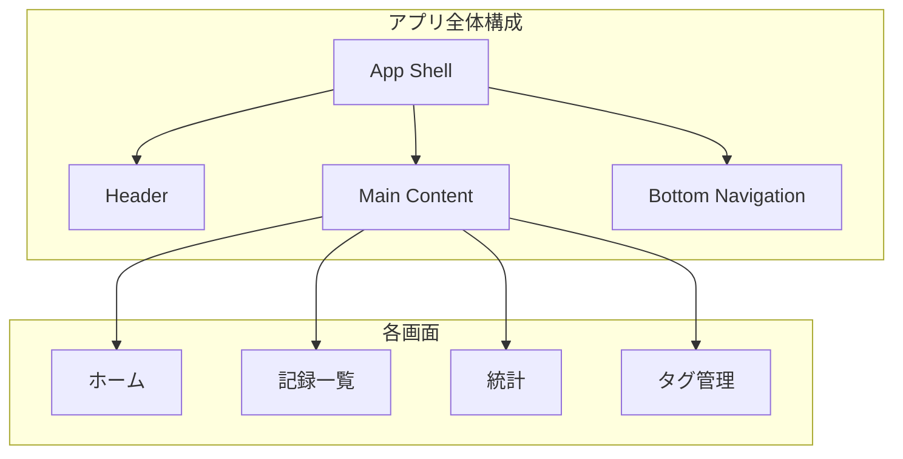
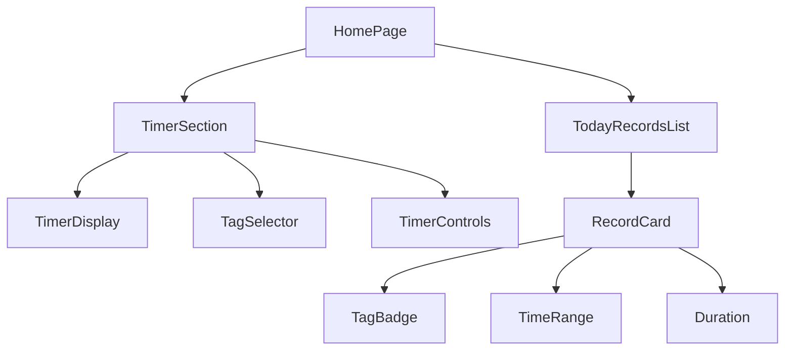
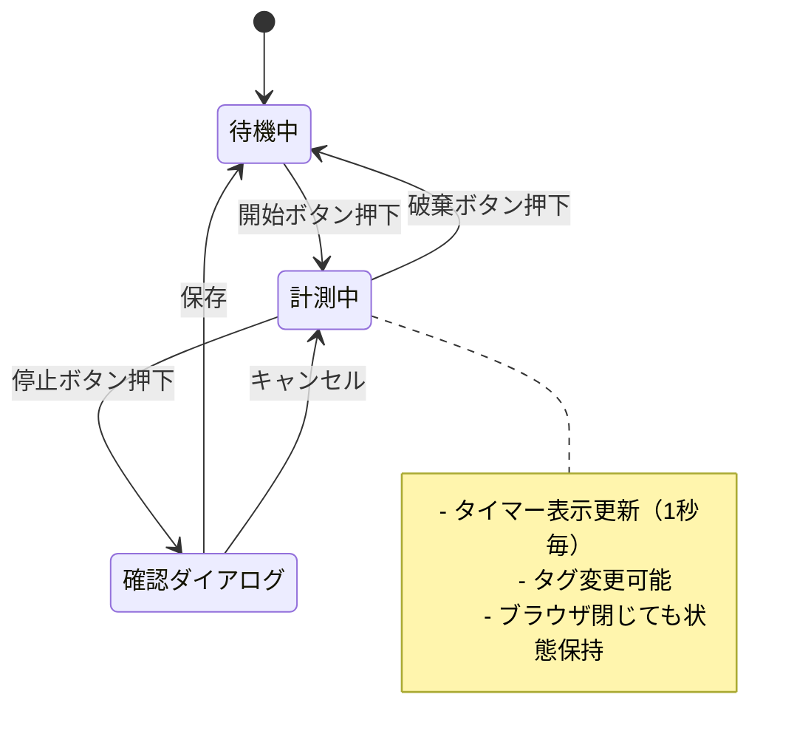
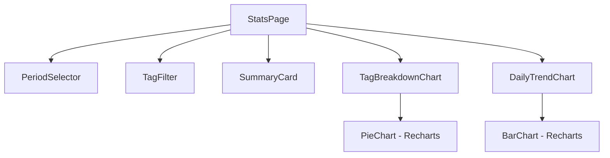
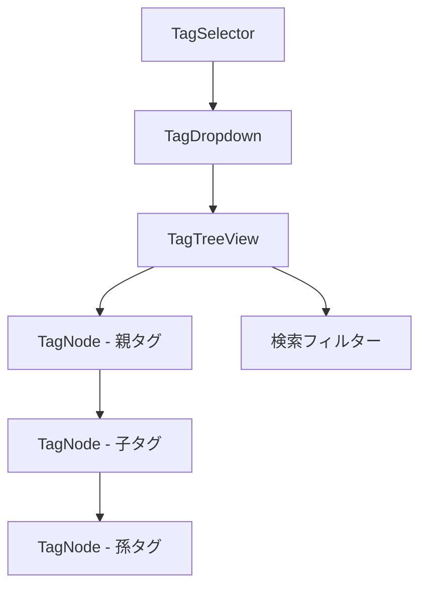
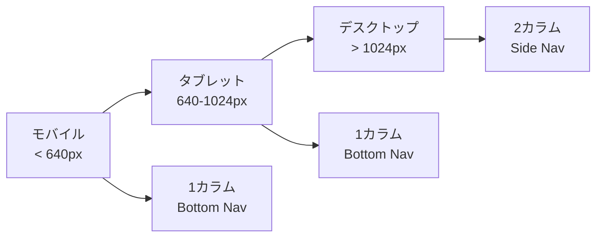
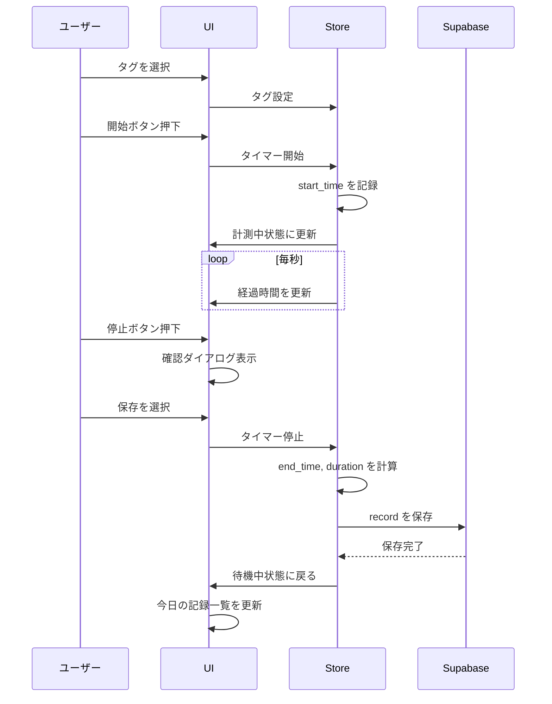

# My Time Logger UI画面設計ドキュメント

## 概要

My Time Loggerの全画面のUI設計を定義するドキュメントです。ダークモードを基調とした、タイマー操作と記録確認の両方がバランス良く使えるUIを設計します。

## 目的

以下の目的でUI設計を行います：

1. **直感的な操作性** - 迷わずタイマーを開始/停止できる
2. **情報の可視化** - 今日の記録がすぐに把握できる
3. **PWA対応** - スマホでも快適に操作できるレスポンシブデザイン
4. **目への優しさ** - ダークモード中心で長時間使用でも疲れにくい

## やること

### 画面一覧

| 画面 | パス | 説明 |
|------|------|------|
| ホーム | `/` | タイマー + 今日の記録一覧 |
| 記録一覧 | `/history` | 過去の記録を日別で確認・編集 |
| 統計 | `/stats` | タグ別・期間別の集計グラフ |
| タグ管理 | `/tags` | タグの作成・編集・階層管理 |

### デザインシステム

#### カラーパレット

ダークモードベースで、アクセントにシアン系を使用します。

```
背景色:
  - Primary Background:   #0a0a0a (ほぼ黒)
  - Secondary Background: #171717 (カード背景)
  - Tertiary Background:  #262626 (入力フィールド等)

テキスト:
  - Primary Text:    #fafafa (メインテキスト)
  - Secondary Text:  #a1a1aa (補助テキスト)
  - Muted Text:      #71717a (非アクティブ)

アクセント:
  - Primary:    #06b6d4 (シアン - メインアクション)
  - Success:    #22c55e (グリーン - 完了/開始)
  - Warning:    #f59e0b (オレンジ - 警告)
  - Danger:     #ef4444 (レッド - 停止/削除)

ボーダー:
  - Default: #27272a
  - Hover:   #3f3f46
```

#### タイポグラフィ

```
フォント: system-ui, -apple-system, sans-serif

サイズ:
  - 見出し1: 24px / bold
  - 見出し2: 20px / semibold
  - 見出し3: 16px / semibold
  - 本文:    14px / normal
  - 補助:    12px / normal
  - タイマー: 48px / bold (等幅)
```

#### スペーシング

```
基本単位: 4px

- xs: 4px
- sm: 8px
- md: 16px
- lg: 24px
- xl: 32px
```

## どうやるか

### 画面構成図



### 共通レイアウト

```
┌─────────────────────────────────────┐
│  Header (アプリ名 / 設定アイコン)    │  56px
├─────────────────────────────────────┤
│                                     │
│                                     │
│         Main Content Area           │  flex-1
│          (各画面の内容)              │
│                                     │
│                                     │
├─────────────────────────────────────┤
│  Bottom Navigation (4つのタブ)       │  64px
└─────────────────────────────────────┘
```

### 1. ホーム画面 (`/`)

#### ワイヤーフレーム

```
┌─────────────────────────────────────┐
│  My Time Logger              ⚙️    │
├─────────────────────────────────────┤
│                                     │
│           ┌─────────────┐           │
│           │   02:34:18  │           │  タイマー表示
│           └─────────────┘           │
│                                     │
│        [    英語学習    ▼]          │  タグ選択
│                                     │
│    ┌─────────┐  ┌─────────┐         │
│    │  開始   │  │  破棄   │         │  アクションボタン
│    └─────────┘  └─────────┘         │
│                                     │
├─────────────────────────────────────┤
│  今日の記録                 計 4h32m │
├─────────────────────────────────────┤
│  ┌─────────────────────────────────┐│
│  │ ● 英語学習 / シャドーイング      ││
│  │   09:00 - 10:30  (1h 30m)       ││
│  └─────────────────────────────────┘│
│  ┌─────────────────────────────────┐│
│  │ ● 開発 / my-timelogger          ││
│  │   11:00 - 13:00  (2h 00m)       ││
│  └─────────────────────────────────┘│
│  ┌─────────────────────────────────┐│
│  │ ● 英語学習 / 瞬間英作文          ││
│  │   14:00 - 15:02  (1h 02m)       ││
│  └─────────────────────────────────┘│
│                                     │
├─────────────────────────────────────┤
│  🏠    📋    📊    🏷️              │
│ ホーム  履歴  統計  タグ             │
└─────────────────────────────────────┘
```

#### コンポーネント階層



#### タイマーの状態遷移



### 2. 記録一覧画面 (`/history`)

#### ワイヤーフレーム

```
┌─────────────────────────────────────┐
│  記録一覧                    🔍     │
├─────────────────────────────────────┤
│                                     │
│  [◀] 2026年1月20日 (月) [▶]        │  日付ナビ
│                                     │
│  合計: 6h 32m                       │
│                                     │
├─────────────────────────────────────┤
│  ┌─────────────────────────────────┐│
│  │ ● 英語学習 / シャドーイング  ✏️ ││
│  │   09:00 - 10:30  (1h 30m)       ││
│  └─────────────────────────────────┘│
│  ┌─────────────────────────────────┐│
│  │ ● 開発 / my-timelogger      ✏️ ││
│  │   11:00 - 13:00  (2h 00m)       ││
│  └─────────────────────────────────┘│
│  ┌─────────────────────────────────┐│
│  │ ● 英語学習 / 瞬間英作文      ✏️ ││
│  │   14:00 - 15:02  (1h 02m)       ││
│  └─────────────────────────────────┘│
│  ┌─────────────────────────────────┐│
│  │ ● 読書                       ✏️ ││
│  │   20:00 - 22:00  (2h 00m)       ││
│  └─────────────────────────────────┘│
│                                     │
│          [+ 手動で記録を追加]       │
│                                     │
├─────────────────────────────────────┤
│  🏠    📋    📊    🏷️              │
└─────────────────────────────────────┘
```

#### 記録編集モーダル

```
┌─────────────────────────────────────┐
│  記録を編集                    ✕    │
├─────────────────────────────────────┤
│                                     │
│  タグ                               │
│  [英語学習 / シャドーイング    ▼]   │
│                                     │
│  開始時間                           │
│  [2026/01/20] [09:00]              │
│                                     │
│  終了時間                           │
│  [2026/01/20] [10:30]              │
│                                     │
│  メモ（任意）                       │
│  ┌─────────────────────────────────┐│
│  │                                 ││
│  └─────────────────────────────────┘│
│                                     │
│  ┌─────────┐  ┌─────────┐  ┌─────┐ │
│  │  削除   │  │ キャンセル│  │保存 │ │
│  └─────────┘  └─────────┘  └─────┘ │
└─────────────────────────────────────┘
```

### 3. 統計画面 (`/stats`)

#### ワイヤーフレーム

```
┌─────────────────────────────────────┐
│  統計                               │
├─────────────────────────────────────┤
│                                     │
│  [今週 ▼]  [すべてのタグ ▼]        │
│                                     │
├─────────────────────────────────────┤
│  合計時間                           │
│  ┌─────────────────────────────────┐│
│  │        32h 45m                  ││
│  │   前週比 +12%                   ││
│  └─────────────────────────────────┘│
│                                     │
├─────────────────────────────────────┤
│  タグ別内訳                         │
│  ┌─────────────────────────────────┐│
│  │    [円グラフ / ドーナツ]        ││
│  │                                 ││
│  │   ● 英語学習  45%  14h 44m     ││
│  │   ● 開発      35%  11h 28m     ││
│  │   ● 読書      15%   4h 55m     ││
│  │   ● その他     5%   1h 38m     ││
│  └─────────────────────────────────┘│
│                                     │
├─────────────────────────────────────┤
│  日別推移                           │
│  ┌─────────────────────────────────┐│
│  │    [積み上げ棒グラフ]           ││
│  │                                 ││
│  │  8h ┤      ██                  ││
│  │  6h ┤  ██  ██  ██              ││
│  │  4h ┤  ██  ██  ██  ██  ██      ││
│  │  2h ┤  ██  ██  ██  ██  ██  ██  ││
│  │     └─月──火──水──木──金──土──日 ││
│  └─────────────────────────────────┘│
│                                     │
├─────────────────────────────────────┤
│  🏠    📋    📊    🏷️              │
└─────────────────────────────────────┘
```

#### グラフコンポーネント



### 4. タグ管理画面 (`/tags`)

#### ワイヤーフレーム

```
┌─────────────────────────────────────┐
│  タグ管理                    [+]    │
├─────────────────────────────────────┤
│                                     │
│  ┌─────────────────────────────────┐│
│  │ ● 英語学習                  ✏️ ││
│  │   ├─ シャドーイング         ✏️ ││
│  │   ├─ 瞬間英作文             ✏️ ││
│  │   └─ 単語                   ✏️ ││
│  └─────────────────────────────────┘│
│  ┌─────────────────────────────────┐│
│  │ ● 開発                      ✏️ ││
│  │   ├─ my-timelogger          ✏️ ││
│  │   └─ その他                 ✏️ ││
│  └─────────────────────────────────┘│
│  ┌─────────────────────────────────┐│
│  │ ● 読書                      ✏️ ││
│  └─────────────────────────────────┘│
│  ┌─────────────────────────────────┐│
│  │ ● 運動                      ✏️ ││
│  │   ├─ ジム                   ✏️ ││
│  │   └─ ランニング             ✏️ ││
│  └─────────────────────────────────┘│
│                                     │
├─────────────────────────────────────┤
│  🏠    📋    📊    🏷️              │
└─────────────────────────────────────┘
```

#### タグ編集モーダル

```
┌─────────────────────────────────────┐
│  タグを編集                    ✕    │
├─────────────────────────────────────┤
│                                     │
│  タグ名                             │
│  [シャドーイング              ]     │
│                                     │
│  親タグ                             │
│  [英語学習                    ▼]    │
│                                     │
│  カラー                             │
│  [🔵][🟢][🟡][🟠][🔴][🟣][⚪]     │
│                                     │
│  ┌─────────┐  ┌─────────┐  ┌─────┐ │
│  │  削除   │  │ キャンセル│  │保存 │ │
│  └─────────┘  └─────────┘  └─────┘ │
└─────────────────────────────────────┘
```

#### タグ選択コンポーネント（階層表示）



### レスポンシブ対応



#### ブレークポイント

| サイズ | 幅 | レイアウト |
|--------|-----|------------|
| sm | < 640px | モバイル（1カラム、Bottom Nav） |
| md | 640-1024px | タブレット（1カラム、Bottom Nav） |
| lg | > 1024px | デスクトップ（2カラム、Side Nav） |

### インタラクション

#### タイマー開始フロー



### PWA対応

#### ホーム画面アイコン

| サイズ | 用途 |
|--------|------|
| 192x192 | Android標準 |
| 512x512 | Android スプラッシュ |
| 180x180 | iOS (apple-touch-icon) |

#### manifest.json 設定

```json
{
  "name": "My Time Logger",
  "short_name": "TimeLogger",
  "description": "時間記録アプリ",
  "theme_color": "#0a0a0a",
  "background_color": "#0a0a0a",
  "display": "standalone",
  "orientation": "portrait",
  "start_url": "/",
  "icons": [...]
}
```

## やらないこと

| 項目 | 理由 |
|------|------|
| ライトモード | 個人利用でダークモード固定 |
| 多言語対応 | 日本語のみ |
| アニメーション過多 | パフォーマンス重視、最小限に |
| 複雑なジェスチャー | シンプルなタップ操作のみ |
| カスタムテーマ | MVP後に検討 |

## 懸念事項

### UI/UX上の懸念

| 懸念 | 影響度 | 対策 |
|------|--------|------|
| タグ階層が深い場合の表示 | 中 | 2階層までは全展開、3階層以降は折りたたみ |
| 長時間計測時のタイマー表示 | 低 | 99:59:59 以上は日数表示に切り替え |
| タグが多い場合の選択 | 中 | 検索機能 + 最近使ったタグを上位表示 |

### 技術的懸念

| 懸念 | 影響度 | 対策 |
|------|--------|------|
| グラフのレンダリング性能 | 低 | データ量制限 + メモ化 |
| PWAのキャッシュ更新 | 中 | Workboxのキャッシュ戦略で対応 |

### 未解決の疑問点

1. **記録の手動追加UI** - モーダル or 専用画面か？
   - → 記録編集と同じモーダルを流用（シンプルさ優先）

2. **統計の期間選択** - カレンダーUIは必要か？
   - → 初期は「今週/今月/今年/全期間」のプリセットのみ

## 参考資料・情報

### デザイン参考

- [shadcn/ui Components](https://ui.shadcn.com/)
- [Tailwind CSS Color Palette](https://tailwindcss.com/docs/customizing-colors)
- [Recharts Examples](https://recharts.org/en-US/examples)

### 類似アプリ参考

- Toggl Track
- Clockify
- RescueTime

---

## 変更履歴

| 日付 | 変更内容 | 担当者 |
|------|----------|--------|
| 2026-01-20 | 初版作成 | - |
