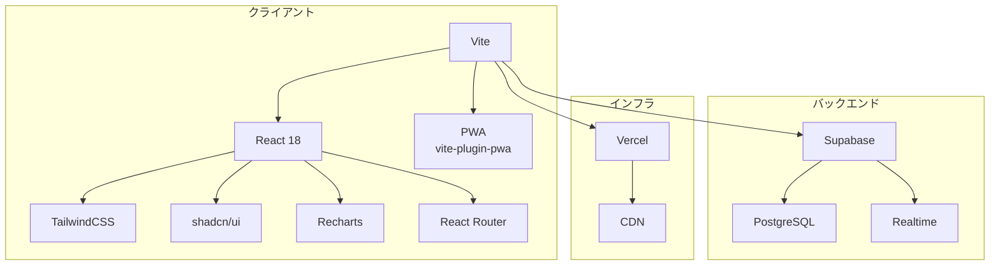
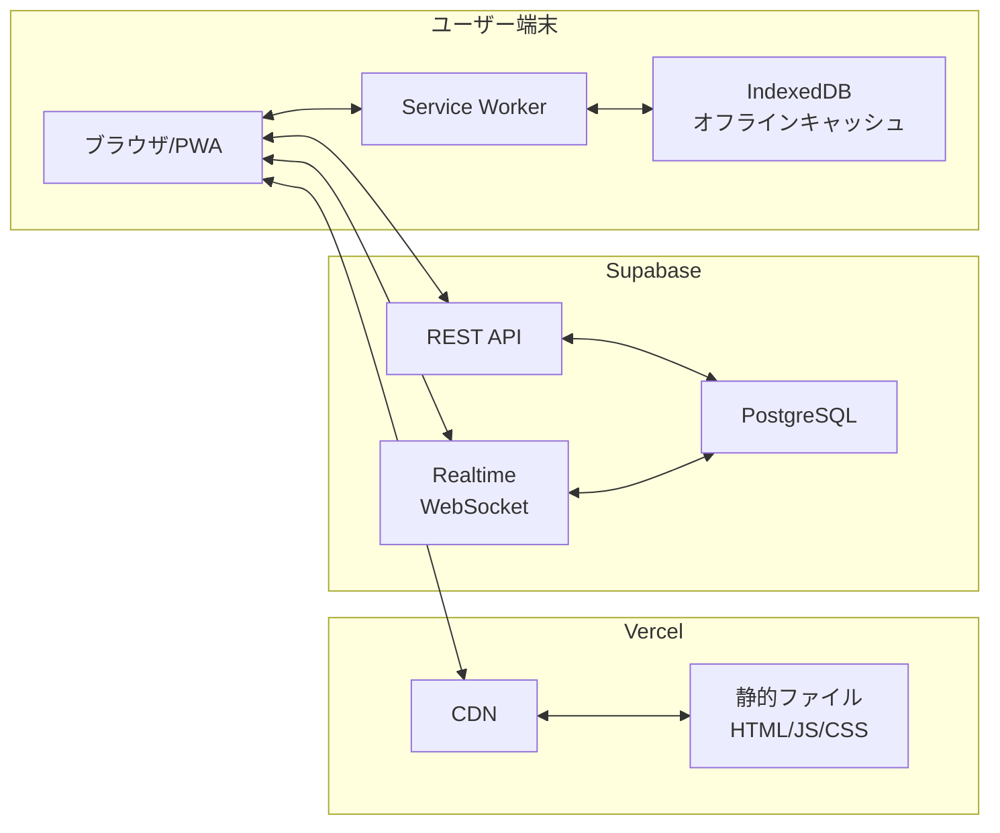
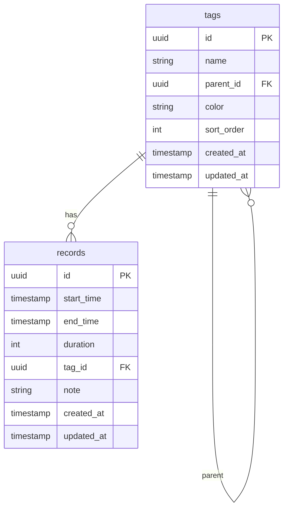
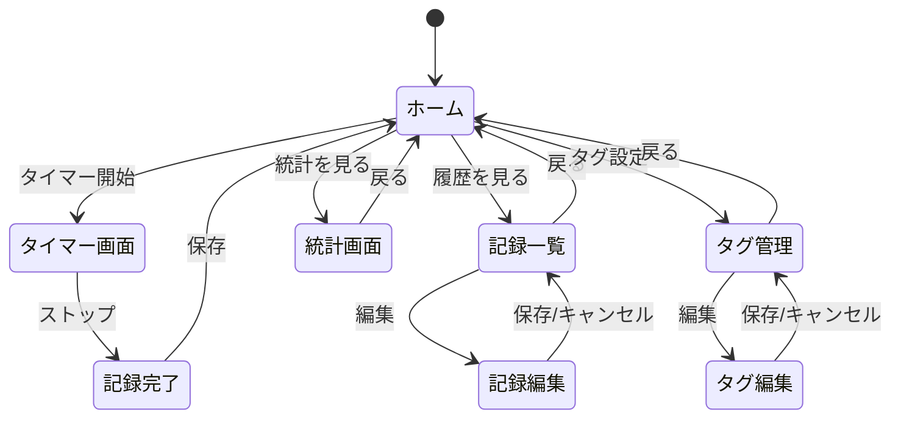
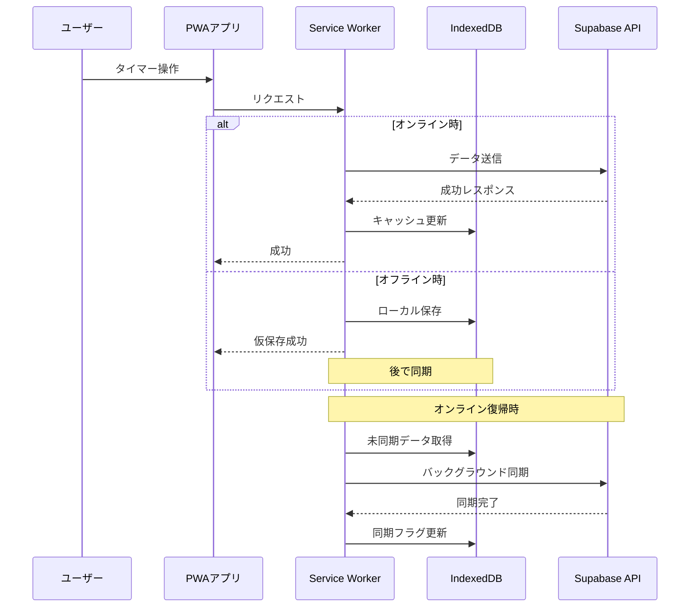

# My Time Logger 技術選定 設計ドキュメント

## 概要

My Time Loggerは、ユーザーが日々の時間の使い方を記録・可視化するためのPWA対応Webアプリケーションです。本ドキュメントでは、このアプリケーションを構築するための技術選定について記載します。

## 目的

以下の要件を満たす技術スタックを選定することが目的です：

1. **ランニングコストの最小化** - 個人利用のため、基本的に無料で運用できること
2. **サクサク動作** - ストレスのない快適なUX
3. **PWA対応** - オフライン対応、ホーム画面追加が可能
4. **複数端末同期** - PCとスマホで同じデータにアクセス可能
5. **開発効率** - 個人開発で無理なくメンテナンスできる技術

## やること

### 機能要件

| 機能 | 説明 |
|------|------|
| タイマー機能 | スタート/ストップで時間記録 |
| タグ管理 | 階層構造を持つタグの作成・編集・削除 |
| 記録編集 | 開始/終了時間、タグの後からの編集 |
| 統計・可視化 | タグ別累計時間、日別推移のグラフ表示 |
| PWA | オフライン対応、ホーム画面追加 |
| データ同期 | 複数端末でのデータ共有 |

### 非機能要件

| 項目 | 要件 |
|------|------|
| パフォーマンス | 初回ロード3秒以内、操作レスポンス100ms以内 |
| 可用性 | Vercel/Supabaseの無料枠で十分なSLA |
| セキュリティ | 認証なし（個人利用のため）、HTTPS必須 |
| スケーラビリティ | 個人利用のため考慮不要 |
| 保守性 | TypeScript必須、テストカバレッジ目標80% |

## どうやるか

### 技術スタック概要



### 各技術の選定理由

#### フロントエンド

| 技術 | 選定理由 | 代替案と却下理由 |
|------|----------|------------------|
| **Vite** | 高速ビルド、シンプルな設定、優れた開発体験 | Next.js: SSR不要な今回はオーバースペック |
| **React 18** | 豊富なエコシステム、情報量が多い | Vue.js: 好みの問題、Svelte: エコシステムが小さい |
| **TypeScript** | 型安全性による保守性向上 | JavaScript: 大規模化で破綻しやすい |
| **React Router** | React標準のルーティング、シンプル | TanStack Router: 学習コスト |
| **TailwindCSS** | 高速スタイリング、ビルドサイズ最適化 | CSS Modules: 記述量が多い |
| **shadcn/ui** | 高品質UIコンポーネント、カスタマイズ性◎、依存なし | MUI: バンドルサイズ大 |
| **Recharts** | Reactネイティブ、軽量、十分な機能 | Chart.js: React統合が弱い |

#### 状態管理

| 技術 | 選定理由 |
|------|----------|
| **TanStack Query** | サーバー状態管理、キャッシュ、オフライン対応が容易 |
| **Zustand** | クライアント状態管理、シンプルで軽量 |

#### バックエンド/データベース

| 技術 | 選定理由 | 代替案と却下理由 |
|------|----------|------------------|
| **Supabase** | PostgreSQL、Realtime同期、無料枠十分（500MB DB、2GB帯域/月） | Firebase: 従量課金が読みにくい |
| **PostgreSQL** | Supabase標準、階層データ対応 | - |

#### インフラ

| 技術 | 選定理由 | 代替案と却下理由 |
|------|----------|------------------|
| **Vercel** | 静的サイトホスティング、無料枠十分（100GB帯域/月） | Cloudflare Pages: 同等だがVercelの方が馴染みがある |

#### PWA

| 技術 | 選定理由 |
|------|----------|
| **vite-plugin-pwa** | Vite公式推奨、成熟したライブラリ、Workbox統合 |
| **Workbox** | キャッシュ戦略の柔軟性、オフライン対応 |

### システムアーキテクチャ



### データベース設計（ER図）



### テーブル定義詳細

#### tags テーブル

| カラム | 型 | 説明 |
|--------|-----|------|
| id | UUID | 主キー |
| name | VARCHAR(100) | タグ名 |
| parent_id | UUID | 親タグID（NULL許可） |
| color | VARCHAR(7) | 表示色（#RRGGBB形式） |
| sort_order | INTEGER | 表示順序 |
| created_at | TIMESTAMP | 作成日時 |
| updated_at | TIMESTAMP | 更新日時 |

#### records テーブル

| カラム | 型 | 説明 |
|--------|-----|------|
| id | UUID | 主キー |
| start_time | TIMESTAMP | 開始時間 |
| end_time | TIMESTAMP | 終了時間（NULL許可：計測中） |
| duration | INTEGER | 継続時間（秒）。end_time - start_time から算出 |
| tag_id | UUID | 紐づくタグID |
| note | TEXT | メモ（任意） |
| created_at | TIMESTAMP | 作成日時 |
| updated_at | TIMESTAMP | 更新日時 |

### 画面遷移図



### ディレクトリ構成

```
my-timelogger/
├── src/
│   ├── main.tsx                # エントリーポイント
│   ├── App.tsx                 # ルートコンポーネント
│   ├── routes/                 # ページコンポーネント
│   │   ├── index.tsx           # ホーム（タイマー）
│   │   ├── history.tsx         # 記録一覧
│   │   ├── stats.tsx           # 統計画面
│   │   └── tags.tsx            # タグ管理
│   ├── components/
│   │   ├── ui/                 # shadcn/ui コンポーネント
│   │   ├── timer/              # タイマー関連
│   │   ├── tags/               # タグ関連
│   │   ├── entries/            # 記録関連
│   │   └── charts/             # グラフ関連
│   ├── lib/
│   │   ├── supabase.ts         # Supabaseクライアント
│   │   └── utils.ts            # ユーティリティ
│   ├── hooks/                  # カスタムフック
│   ├── stores/                 # Zustandストア
│   └── types/                  # 型定義
├── public/
│   └── icons/                  # PWAアイコン
├── docs/
│   └── design/                 # 設計ドキュメント
├── tests/                      # テスト
├── index.html                  # HTMLテンプレート
├── vite.config.ts              # Vite設定
└── tailwind.config.js          # Tailwind設定
```

### オフライン対応フロー



### コスト試算

| サービス | 無料枠 | 想定使用量 | 月額コスト |
|----------|--------|------------|------------|
| Vercel | 100GB帯域、無制限デプロイ | 1GB未満 | ¥0 |
| Supabase | 500MB DB、2GB帯域、50K MAU | 100MB、500MB | ¥0 |
| ドメイン（任意） | - | - | ¥0〜1,500/年 |
| **合計** | - | - | **¥0** |

## やらないこと

| 項目 | 理由 |
|------|------|
| 認証・ログイン機能 | 個人利用のため不要 |
| 課金機能 | 不要 |
| マルチユーザー対応 | 不要 |
| ネイティブアプリ | PWAで十分 |
| SSR/SSG | SEO不要、クライアントサイドで完結 |
| 複雑なレポート機能 | MVP後に検討 |
| データエクスポート | MVP後に検討（あれば便利だが優先度低） |
| タイムゾーン対応 | 個人利用で日本のみ想定 |

## 懸念事項

### 技術的懸念

| 懸念 | 影響度 | 対策 |
|------|--------|------|
| オフライン同期の競合 | 中 | Last Write Winsで簡易実装、複雑なケースは後回し |
| Supabase無料枠の制限 | 低 | 個人利用なら十分、超過時は有料プラン検討 |
| PWAのiOS Safari制限 | 中 | 基本機能は動作確認済み、一部制限は許容 |
| Service Workerのデバッグ | 中 | Chrome DevToolsで対応可能 |

### 運用上の懸念

| 懸念 | 影響度 | 対策 |
|------|--------|------|
| Supabase障害時 | 中 | オフラインモードで継続利用可能 |
| データバックアップ | 中 | 定期的なエクスポート機能を将来実装 |

### 未解決の疑問点

1. **タグの階層の深さ制限** - 現状無制限だが、UIの観点から2-3階層に制限すべきか？
   - → 一旦制限なしで実装し、UIで深すぎる場合は警告を表示

2. **計測中のブラウザ閉じ対応** - Service Workerでバックグラウンド計測するか？
   - → 初期はlocalStorageに状態保存、ブラウザ再開時に復帰で対応

## 参考資料・情報

### 公式ドキュメント

- [Vite](https://vitejs.dev/)
- [React](https://react.dev/)
- [React Router](https://reactrouter.com/)
- [Supabase Documentation](https://supabase.com/docs)
- [shadcn/ui](https://ui.shadcn.com/)
- [TailwindCSS](https://tailwindcss.com/docs)
- [vite-plugin-pwa](https://vite-pwa-org.netlify.app/)
- [TanStack Query](https://tanstack.com/query)
- [Zustand](https://zustand-demo.pmnd.rs/)
- [Recharts](https://recharts.org/)

### 参考記事

- [Vite + React + TypeScript Setup Guide](https://vitejs.dev/guide/)
- [Supabase + React Integration](https://supabase.com/docs/guides/getting-started/quickstarts/reactjs)
- [Building PWAs with Vite](https://vite-pwa-org.netlify.app/guide/)

---

## 変更履歴

| 日付 | 変更内容 | 担当者 |
|------|----------|--------|
| 2026-01-20 | 初版作成 | - |
| 2026-01-20 | Next.js → Vite + Reactに変更 | - |
